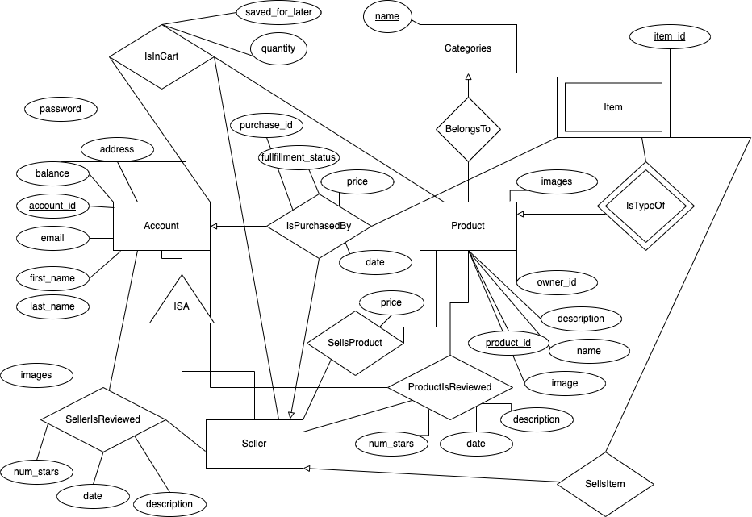

# Amazon+ Design

## ER Diagram

## Explanation

### Accounts

There are two types of accounts: normal users and sellers. Every account is a normal user, meaning that every user can purchase items. Some accounts are additionalyl sellers, meaning that they also are vendors for certain items. Accounts are referenfed by their ID and include a balance, password, address, email, and name.

### Products and Items

Every seller sells various types of products. Products define a general item. For example, a product could be a Apple Macbook Pro. Then, various sellers can sell that product by registering items. In this sense, an item corresponds to the physical entity, while the product is the description of the physical item. Multiple sellors can sell the same type of product with various prices.

Items are referenced by a specific ID. This allows sellors to track each individual item that they sell. In the user interface, the item IDs are not shown the consumers, and instead a quantity is shown. This is the number of items they are purchasing, which is determined by summing over the number of items in the database. So, for example, if the inventory for a seller is 2, this means that two specfic items exist in the SellsItem relation.

### Categories

Each product falls into some pre-determined category, such as technology or books. This allows users to sort for products easier, which allows them to then purchase items.

### Purchasing Carts

Purchasing follows a simple user flow. A user searches for products that they want, and they add them to their cart. Then, once all the desired items are in the cart, the user can purchase the entire cart. This creates an order with a purchase ID, so the user can refer to the order at a later date.

This simple process allows validation to occur at checkout, ensuring that users have proper balances and sellers have proper inventories. Moreover, if a user has insufficient funds or too many of a certain item, they can add this to a saved for later section. This is a persistent relation that tracks products being sold by specific vendors that a user is interested in for later dates.

### Purchasing History

A buyer can always view the orders they have purchased. This is seen in the Purchase History, showing all of the carts that have been ordered. By clicking on one, a user can see the specific products, selllers, and quantities in the order. 

A status is given to each order, which shows whether it has been ordered, shipped, or fulfilled. The status for the order defaults to the lowerst possible status—meaning if any item in the order is still not shipped, then the entire order is listed as not shipped. The rankings are ordered is lowest, and fulfilled is highest. The same logic applies to items of a certain product and seller in an order page. This means that if two items of a certain product are purchased from a seller in an order, the status on those items will default to the lowest status as specified in the rankings above.

Of course, in the database, a status is kept for each item. This is shown to the seller where they can update their inventory. However, for the consumer, they do not see entires on an item-by-item basis, so this generalization is made.

### Images

You may note that our handling of images is rather efficient. Instead of storing entire image files in our database, which would be costly, we instead store strings. There are URLs which map to images online. The idea here is that a professional service could use a site like Dropbox, which has efficient storage specifically designed for images. Storing the URL for these images makes the databse smaller and cleaner.

This did result in a less-than-appealing UI, since we generated random data by using a few online image generators. In real life, we would create hundreds of fake images and upload them to Dropbox; however, for the sake of this assignment, we did not have time to do that.

### Review

Lastly, users can review sellers and the products that they sell. These reviews exist in two separate relations: SellerReview and ProductReview. This allows users to rate people and the things that they sell. In SellerReview, users can review the accounts that sell the prodcuts they buy—indicating whether they are kind and timely. In ProductReview, users can review the prodcuts sold by specific accounts—inidicating whether the actual objects sold meet expectations. For this, we have checks to ensure that you can only review items if you have bought them and sellers if you have bought from them.

